# springbootA373
springbootA373动物园管理系统LW
 
## 查看主页获取源码

### 一、关键词

动物信息管理、动物园管理系统、野生动物园保护管理系统

 

### 二、作品包含

源码+数据库+万字文档+全套环境和工具资源+部署教程

 

### 三、项目技术

前端技术：Html、Css、Js、Vue2、Element-ui 
数据库：MySQL
后端技术：Java、SpringBoot2.0、MyBatis

  
 

### 四、运行环境(以下版本亲测，其他版本未知，请自测)

开发工具：IDEA/eclipse  + vscode

数据库：MySQL5.7 （最低要5.7版本）

数据库管理工具：Navicat10以上版本

环境配置软件： JDK1.8 + Maven3.6.3

前端Nodejs：16

浏览器：谷歌浏览器

### 五、项目介绍

项目编号：springbootA373

该平台采用前后端分离架构，提供了用户注册登录、动物种类管理、动物基本信息管理、动物行为管理、动物救助信息管理和购票等核心功能。利用RESTful API实现前后端交互，通过MySQL进行数据存储和管理，确保系统的稳定性和安全性。本项目旨在提供一个高效、便捷、安全的智能动物园管理系统。

动物园系统，前台为用户提供登录注册、个人中心、预约购票、游览信息及动物信息查询等服务；后台涵盖收入、票务、动物健康（看护、疫苗 ）、行为观察、饲养、园区设施与活动（演出 ）、动物及各类人员（角色、部门、员工 ）、考勤等管理，还有审核、首页等功能 。

### 六、运行截图

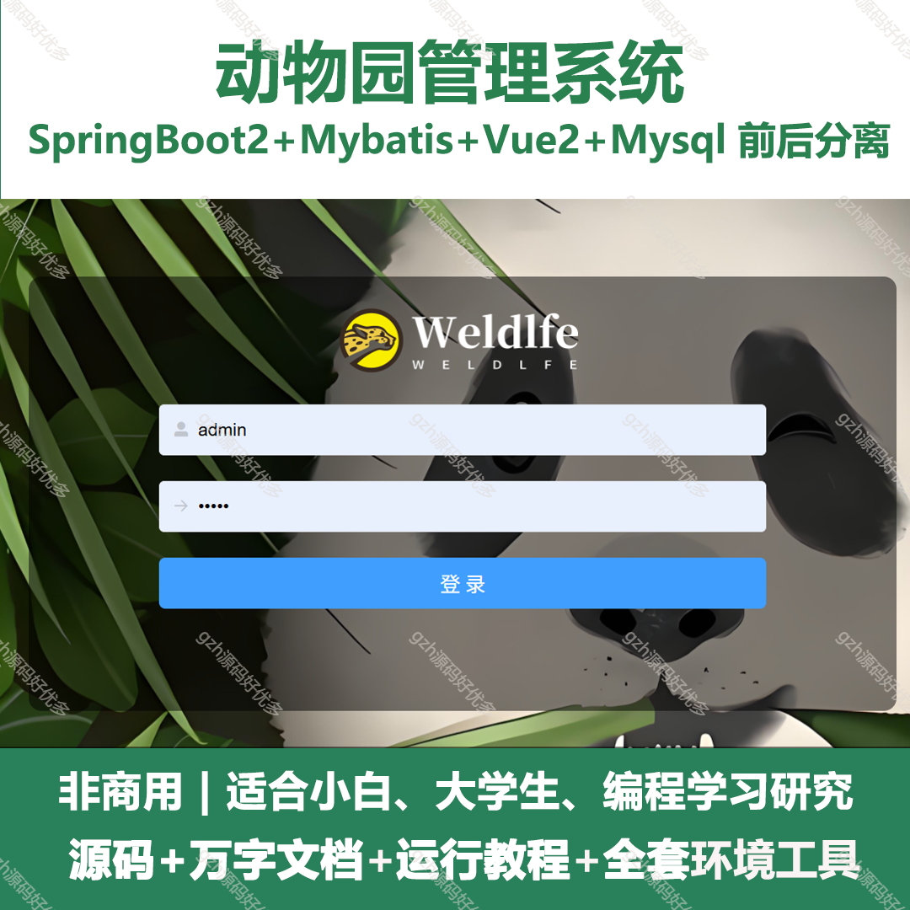
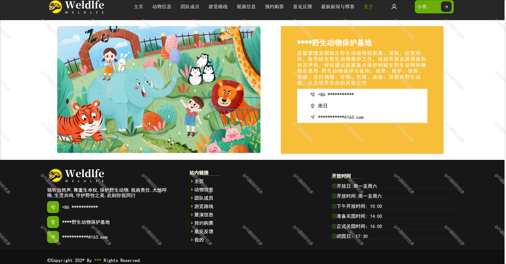
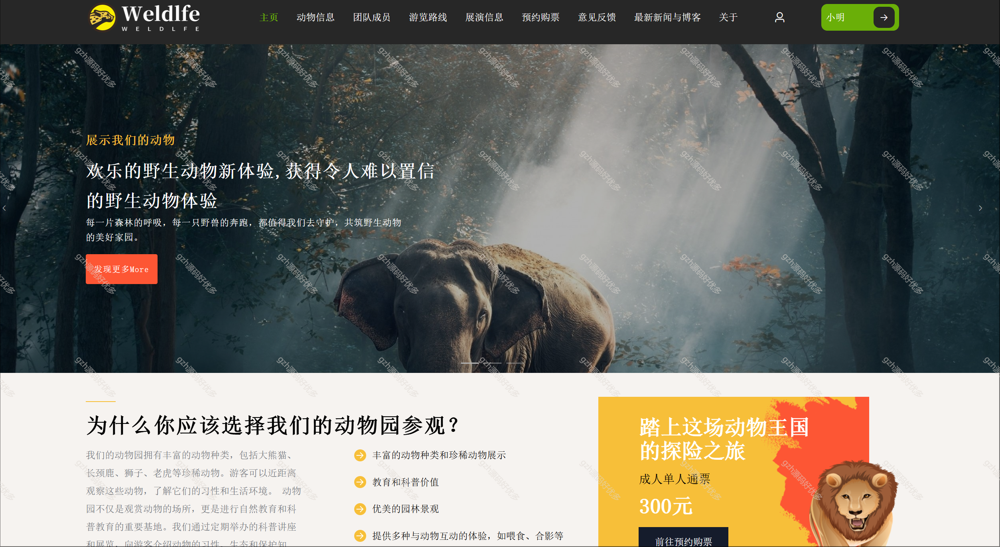
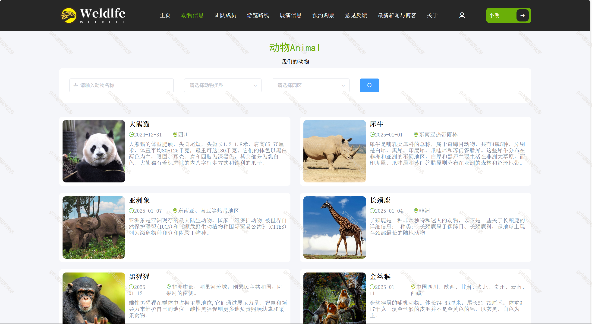
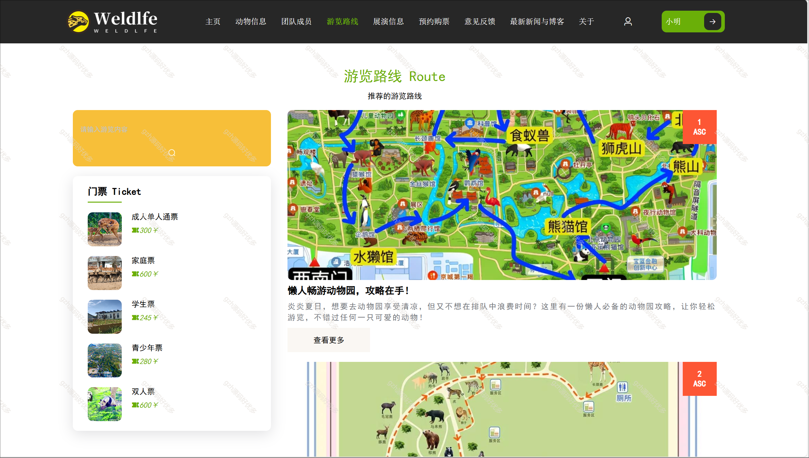
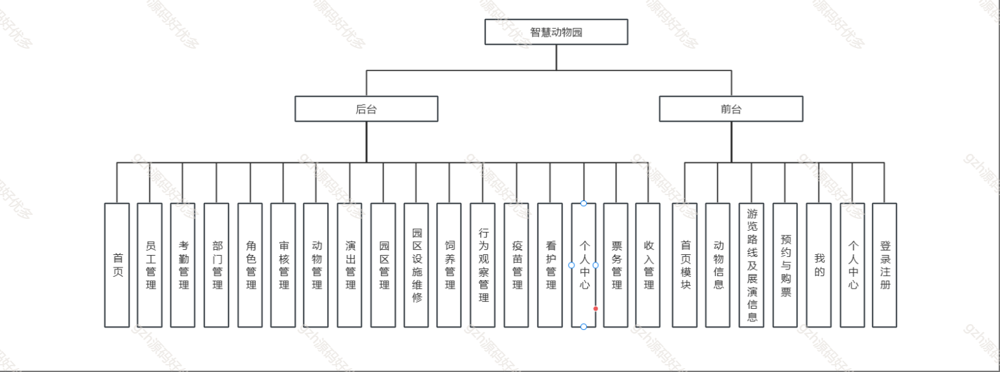
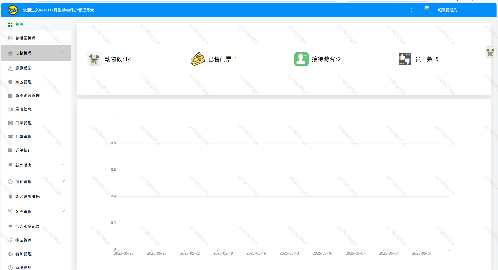
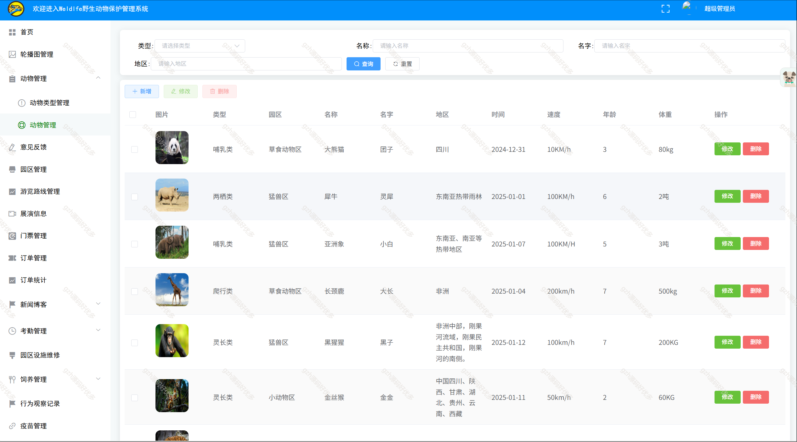
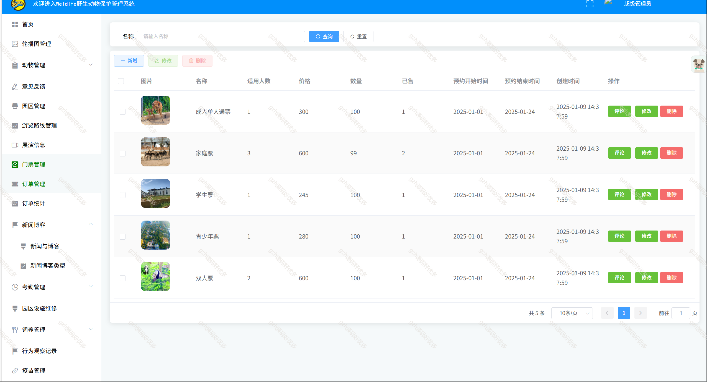
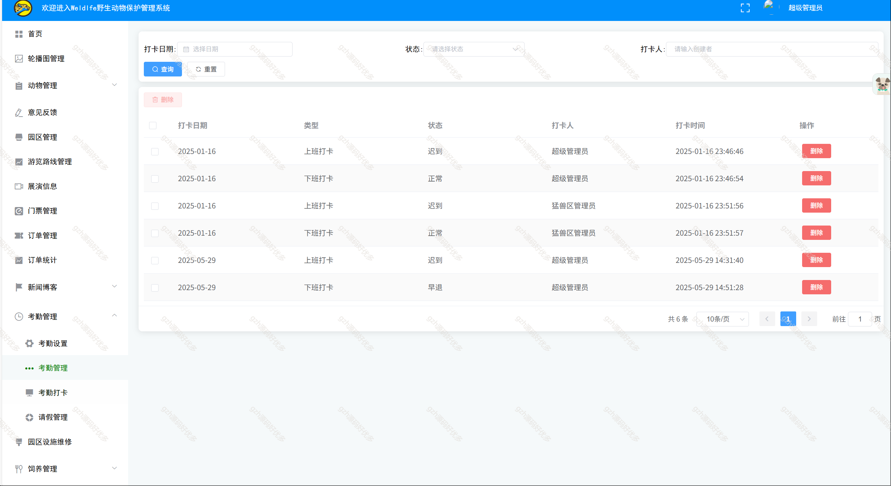
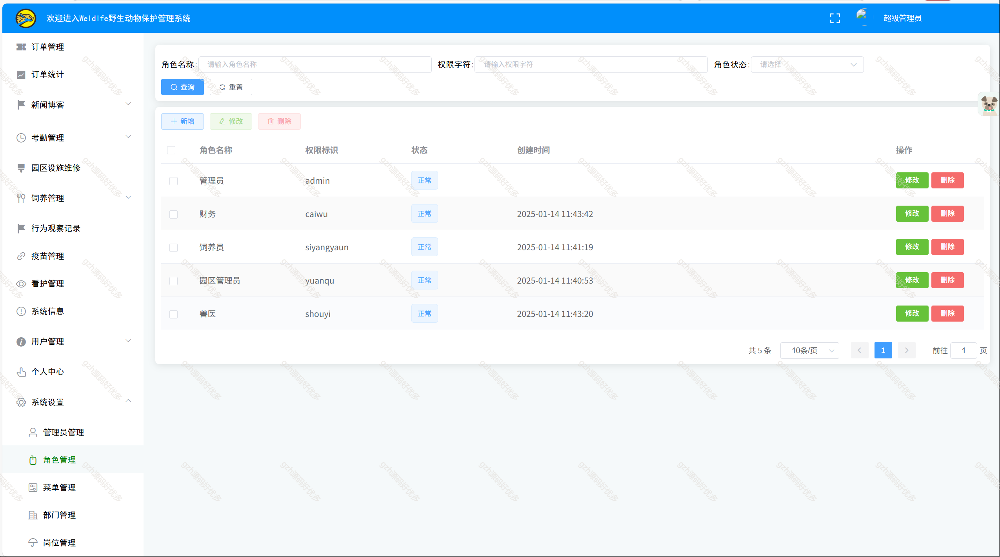
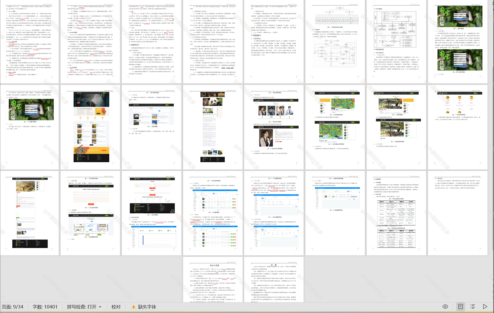
